<div align="center">

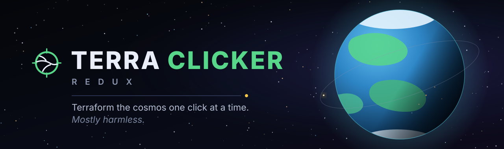

<p>
  <a href="https://tannermidd.github.io/terraclicker-redux/play/"></a>
  <a href="https://tannermidd.github.io/terraclicker-redux/"></a>
</p>

**No account · no install · no ads · your save stays in your own browser · desktop and phone**

</div>

---

## You have been assigned a planet

Nobody asked whether you wanted one. It is dry, airless and roughly the colour of a filing
cabinet, and the paperwork says you have until it isn't.

So click it. Every click buys Terraform Units, every Unit buys industry, and the industry
fills four gauges — **Thermal**, **Atmospheric**, **Hydrologic**, **Biotic**. Those gauges
are not a progress bar. They are uniforms wired straight into the planet's shader, so the
ice caps genuinely retreat, the oceans genuinely find the low ground, vegetation genuinely
climbs out of the coastlines, and the night side genuinely lights up. There is no separate
artwork for *sixty percent done*. There is only the planet, at sixty percent.

Fill all four and the commission closes — and the world doesn't vanish to make room for the
next one. It takes an orbit and stays there while a stranger world drifts in. Five planets
make a system, five systems a galaxy, and the galaxy starts, slowly, to turn.

> **Click** → **Terraform Units** → **14 tiers of industry** → **four gauges** → **a finished world that stays** → ↻ *something stranger arrives*

Then, when you have a ship, you can go back and visit any of it. Press <kbd>F</kbd> and the
camera becomes the company runabout. Nothing out there is scenery: the worlds are solid, the
Deep Field was placed by your universe's seed before you arrived, and any planet with a floor
will let you land on it and get out and walk around, at one unit to the metre, on ground you
made. The settlement lights you saw on the night side turn out to be a town — lit, or not,
by how well you have looked after the place.

Eventually a custom-planet firm with an old reputation offers to buy the entire portfolio.
Take the money. Everything resets except the Blueprints and a short list of things the mice
were never buying: your Guide entries, your logbook, the laws you passed, the monuments.

## Have a look

*Captured headlessly with `scripts/shot.mjs` — the same rig the project uses for visual
verification, which is why they look like the game rather than like a poster.*

### The planet

| | |
|---|---|
| 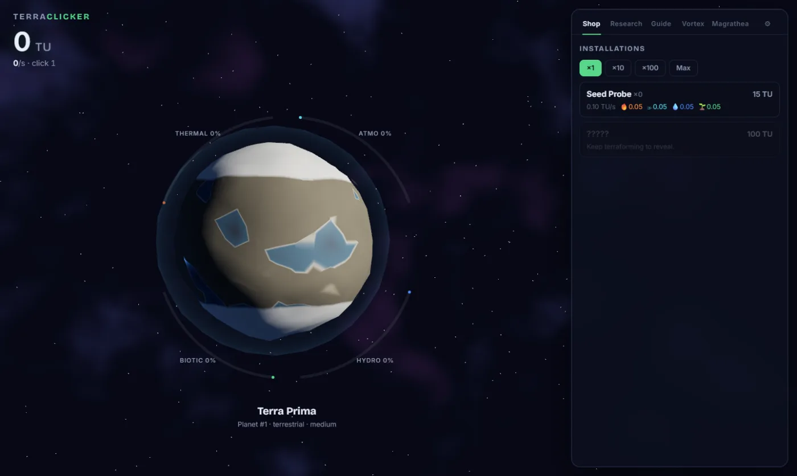 | 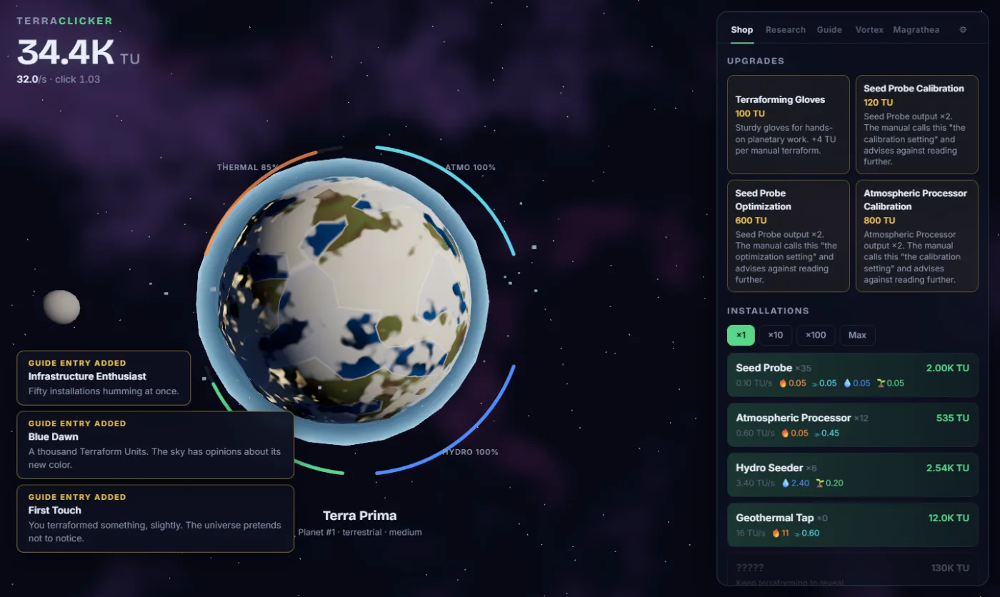 |
| *Hour one. Dry basins, big ice caps, thin air.* | *The same world under management: oceans risen, vegetation creeping, your satellites on station.* |
| 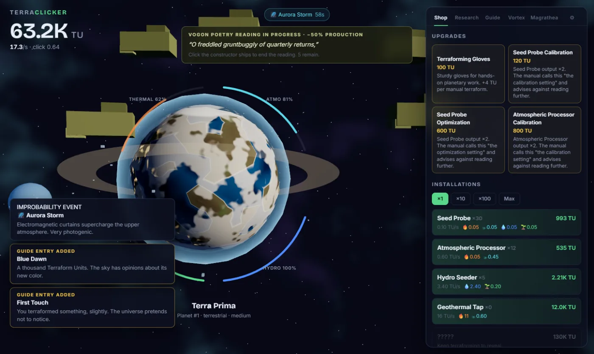 |  |
| *A Vogon poetry reading in progress. Production −50%. The ships hang in the sky in much the same way that bricks don't.* | *A volcanic commission, lava veins still warm, and Magrathea's offer on the desk.* |
| 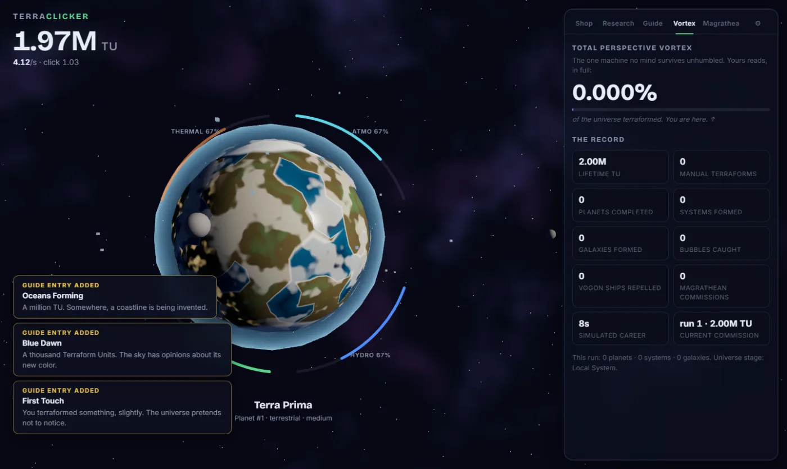 | 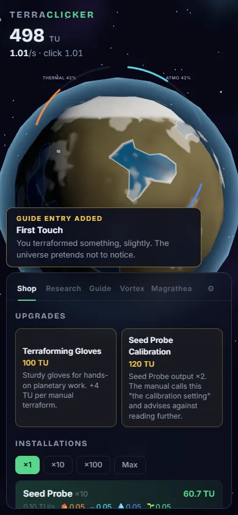 |
| *The Total Perspective Vortex. You are here.* | *One-hand mode: planet up top, Guide below, same save.* |

### Out there

| | |
|---|---|
| 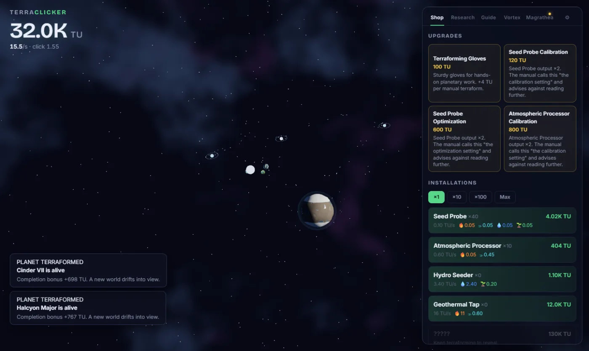 | 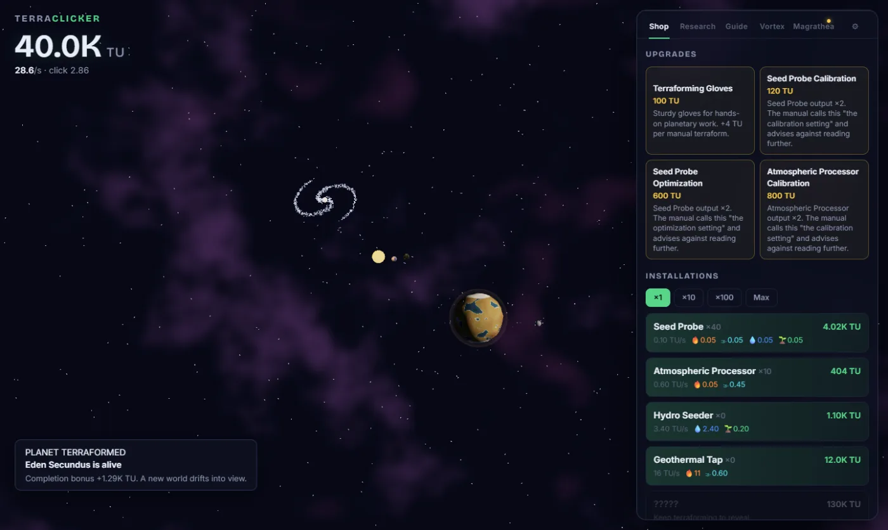 |
| *Scroll out: every world you finished is still there, orbiting the star it was billed to.* | *Twenty-five worlds later, a galaxy swallows its five systems and begins to turn.* |
| 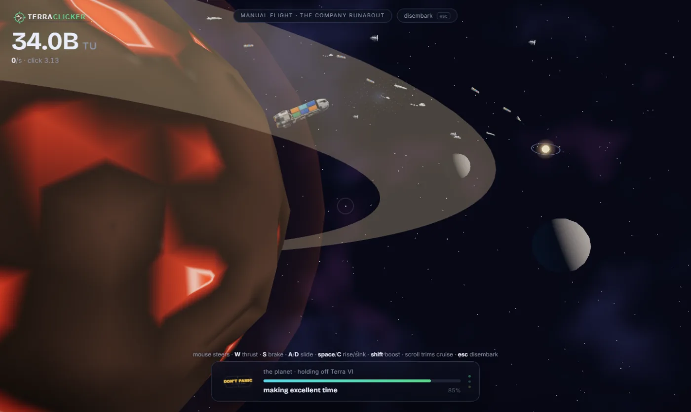 | 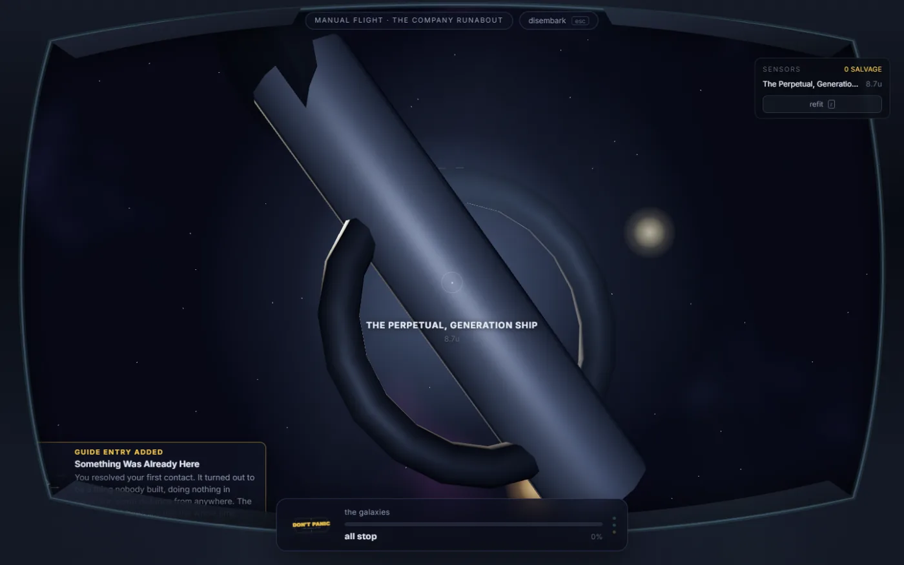 |
| *Press `F` and the camera becomes the runabout. Nothing out here is staged for you.* | *A Deep Field landmark, scanned. It was here before you and is unmoved by the commission.* |

### On the ground

| | |
|---|---|
| 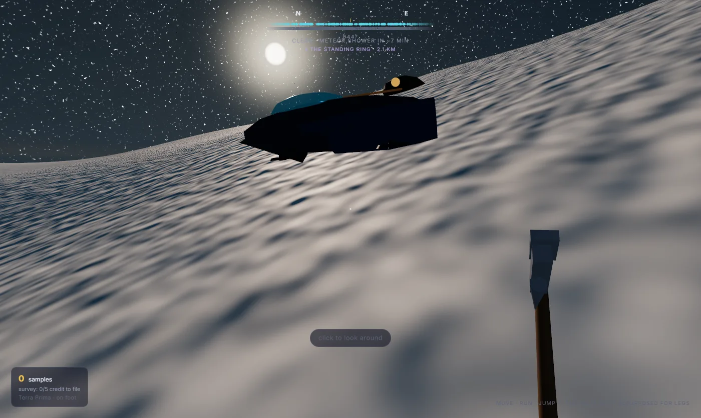 | 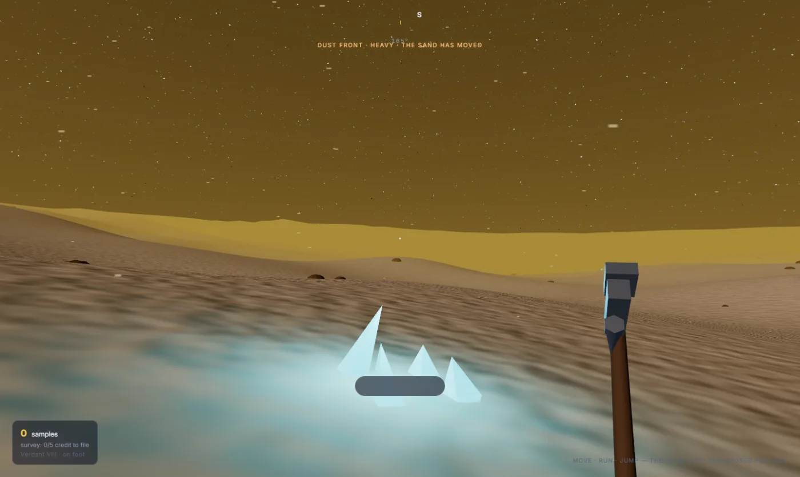 |
| *Boots on a world you finished. The coastline is the one you watched fill from orbit — a test holds the two together.* | *A heavy dust front. It never hurts you; it changes what you can do, and it has just uncovered a seam the sand was sitting on.* |

<div align="center">

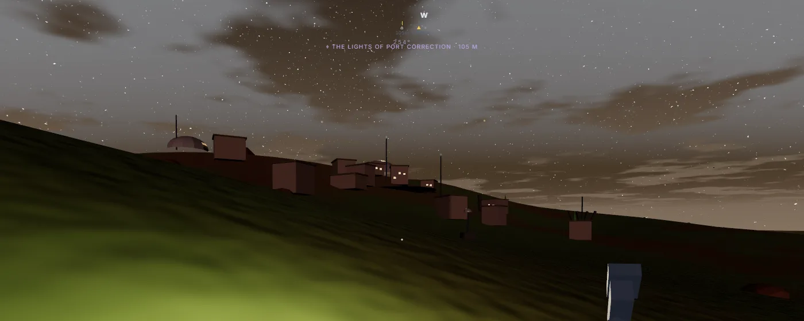

*Port Correction, 105 m off. You built the world; somebody else moved in.*

</div>

## Also in the box

|  |  |
|---|---|
| **Marvin** | Buy him once. He clicks the planet every second, forever, and mentions how he feels about it. |
| **Research, including the Answer** | One item takes 42 real hours and pays a permanent +42% through every prestige. Its description is "42". The follow-up never finishes. |
| **Improbability** | Heart of Gold drives raise the improbability level and improbable things start turning up: whales, petunias, bubbles worth clicking. |
| **Weather that is arithmetic** | A pure function of world, place and clock — so the front you see turning from orbit is the dust you land in. |
| **The Survey Skimmer** | A ground-effect sled that folds out of the runabout in three salvage-funded ranks; the last one makes open water something you cross. |
| **Six planet types, fourteen quirks** | One world refuses to terraform on Mondays. One has a pet asteroid, which has a name you are not told. Planet 42 is always Earth. |
| **An actual ending** | There is a booking at a restaurant at the end of things. It turns out to have been made already. It pays no multiplier. |

---

## For the curious (and the compiler)

<details>
<summary><b>Run it locally</b></summary>

```bash
npm install
npm run dev        # http://localhost:5173
```

| Command | What |
|---|---|
| `npm run dev` | Vite dev server |
| `npm test` | engine test suite (determinism, offline parity, saves, pacing bands) |
| `npm run balance` | headless bot harness — pacing timelines in your terminal |
| `npm run build` | typecheck + production build to `dist/` |
| `npm run site` | build + assemble the published site into `site/` |
| `npm run site:preview` | serve `site/` at http://localhost:4180 (landing + game together) |
| `npm run landing:check` | headless landing-page audit at six widths (needs `site:preview`) |
| `npm run deploy` | build, assemble, push, and verify the live bundle hash |
| `node scripts/shot.mjs out.png` | headless verification screenshot (Playwright) |

</details>

<details>
<summary><b>How it is built</b></summary>

A **pure, deterministic engine** (`src/engine`) advances in exact 250 ms ticks with seeded
RNG streams stored in the save — one 8-hour offline call and 480 one-minute calls produce
bit-identical states, and that is a unit test, not a hope. **Content is data**
(`src/content`), rules are small modules, and everything derived is recomputed, never
persisted. The scene (`src/ui/scene`) is three.js **WebGPURenderer + TSL** node materials
(automatic WebGL2 fallback) driven by the four terraforming gauges as shader uniforms;
React renders the Guide-styled UI and never simulates. Saves are zod-validated, versioned,
migrated, and exportable as compressed "Share and Enjoy" strings.

The surface is the same promise held twice: `surface/terrainField.ts` evaluates the exact
macro field `planetGeometry.ts` does, so the continent you saw from orbit is the continent
you land on, and a test locks the two together.

Built to the specs in [DESIGN.md](DESIGN.md), [docs/ART_DIRECTION.md](docs/ART_DIRECTION.md),
[docs/PROGRESSION.md](docs/PROGRESSION.md) and [docs/EXPEDITIONS.md](docs/EXPEDITIONS.md).

</details>

<details>
<summary><b>What gets published</b></summary>

Two things ship to `https://tannermidd.github.io/terraclicker-redux/`:

| Path | What | Source |
|---|---|---|
| `/` | landing page — what the game is, what's in it, screens, FAQ | `landing/` (hand-written HTML/CSS, no build step) |
| `/play/` | the game | `dist/` (vite build; `base` is `'./'`, so the path doesn't matter) |

`scripts/assemble-site.mjs` owns that layout and is the only place it's defined — both
`npm run deploy` and the Pages workflow go through it. Saves are keyed to the origin, not
the path, so moving the game under `/play/` did not disturb anyone's run.

Landing screenshots are re-encoded from `docs/screenshots/*.png` to WebP by
`npm run shots:optimize` and committed to `landing/media/`. `npm run landing:check` is the
front door's answer to `shot.mjs`: it loads the page at six widths against a running
`site:preview` and fails on console errors, dead requests, broken images, missing alt text
or horizontal overflow.

</details>

---

<div align="center">

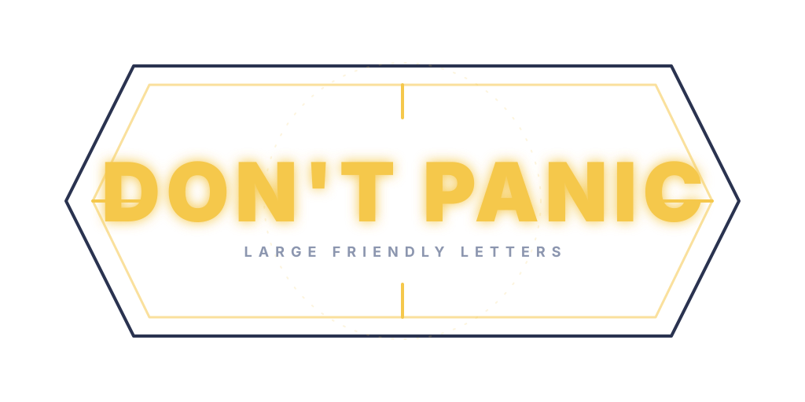

### The planet isn't going to click itself

Well — it is, eventually. You have to buy Marvin first.

**[▶ Play TerraClicker Redux](https://tannermidd.github.io/terraclicker-redux/play/)**

</div>

---

**License:** TBD before any public release. The Hitchhiker references are affectionate homage
in original words; no text from the books is reproduced, and this is not endorsed by or
associated with the rights holders.
