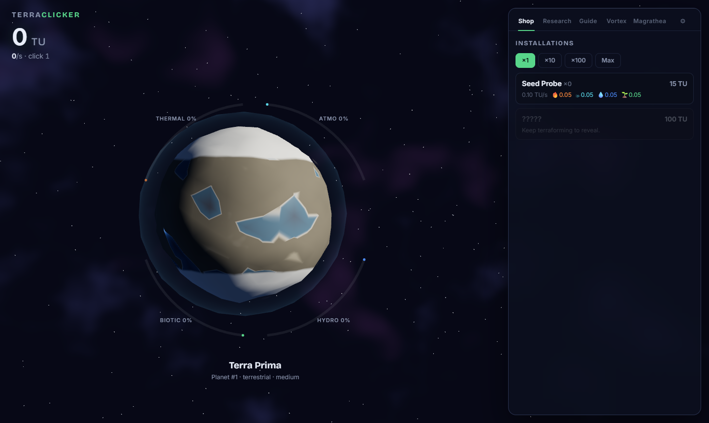
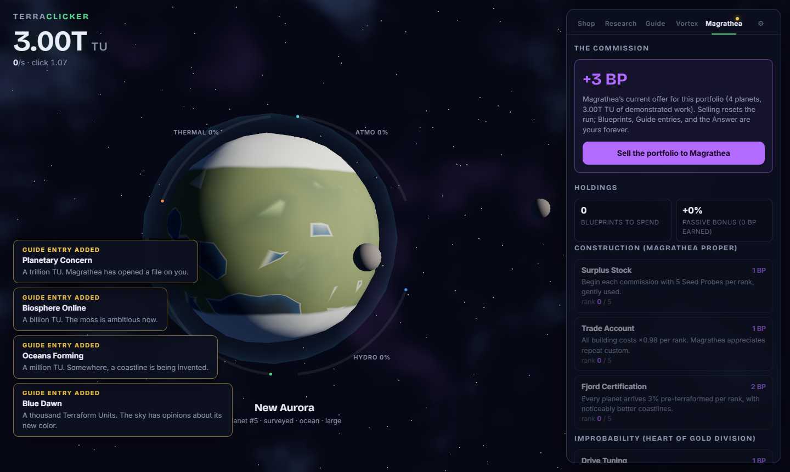
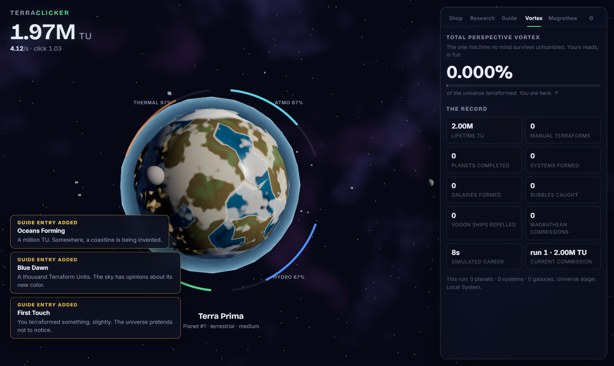
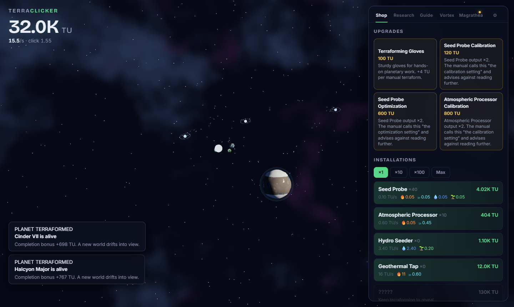
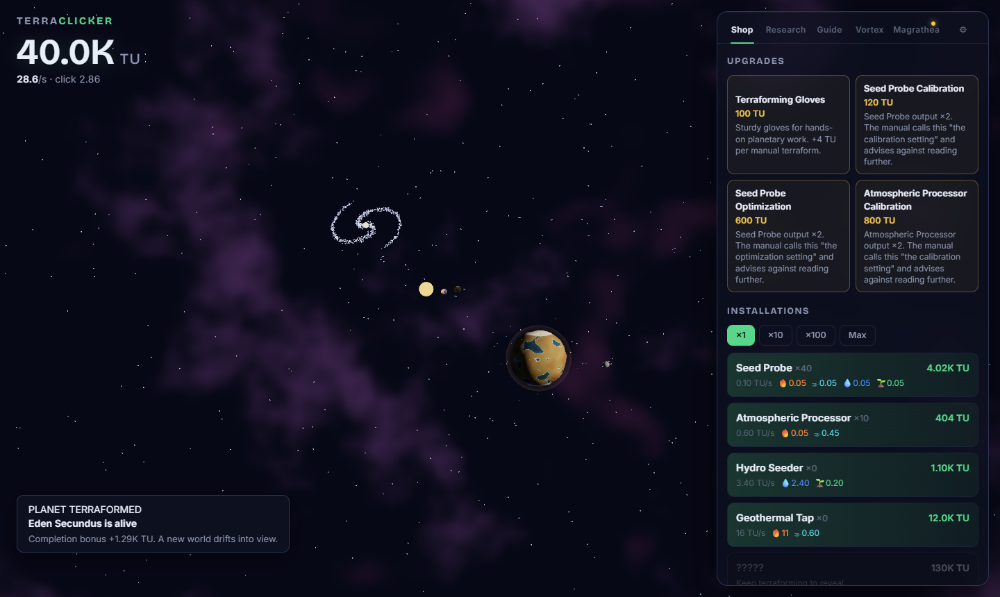

# TerraClicker Redux

> Terraform the cosmos one click at a time. Mostly harmless.

A Hitchhiker-flavored incremental game where the cookie is a planet. Click it, industrialize
it, watch ice caps recede and oceans rise and city lights wake on the night side — then
finish it, and a stranger world drifts in. Five planets form a system, five systems a
galaxy, and when Magrathea reopens, you sell the whole portfolio to the mice and start
again, richer in Blueprints.

Built to the specs in [DESIGN.md](DESIGN.md), [docs/ART_DIRECTION.md](docs/ART_DIRECTION.md),
and [docs/PROGRESSION.md](docs/PROGRESSION.md).

## Showcase

*(Captured headlessly with `scripts/shot.mjs` — the same rig used for visual verification.)*

| | |
|---|---|
|  |  |
| *Terra Prima, untouched. Dry basins, big ice caps, thin air.* | *The same planet under management: oceans risen, vegetation creeping, clouds forming, your satellites in orbit.* |
|  |  |
| *A Vogon poetry reading in progress. Production −50%. The ships hang in the sky in much the same way that bricks don't.* | *A volcanic commission, lava veins still warm, and Magrathea's offer on the desk.* |
|  |  |
| *The Total Perspective Vortex. You are here.* | *One-hand mode: planet up top, Guide below.* |
|  |  |
| *Scroll out: every world you finished is still there — orbiting its star, forming systems, running freighter routes.* | *Twenty-five worlds later, a galaxy swallows its five systems and starts to turn.* |

## Run it

```bash
npm install
npm run dev        # http://localhost:5173
```

| Command | What |
|---|---|
| `npm run dev` | Vite dev server |
| `npm test` | engine test suite (determinism, offline parity, saves, pacing bands) |
| `npm run balance` | headless bot harness — pacing timelines in your terminal |
| `npm run build` | typecheck + production build to `dist/` |
| `node scripts/shot.mjs out.png` | headless verification screenshot (Playwright) |

## Architecture in one breath

A **pure, deterministic engine** (`src/engine`) advances in exact 250 ms ticks with seeded
RNG streams stored in the save — one 8-hour offline call and 480 one-minute calls produce
bit-identical states, and that is a unit test, not a hope. **Content is data**
(`src/content`), rules are small modules, and everything derived is recomputed, never
persisted. The scene (`src/ui/scene`) is three.js **WebGPURenderer + TSL** node materials
(automatic WebGL2 fallback) driven by the four terraforming gauges as shader uniforms;
React renders the Guide-styled UI and never simulates. Saves are zod-validated, versioned,
migrated, and exportable as compressed "Share and Enjoy" strings.

## The important facts

- The planet you are clicking is being visibly terraformed by the numbers you generate.
- Marvin will click it for you, once per second, and he will not be thanked.
- Vogon constructor ships hang in the sky in much the same way that bricks don't.
- The number 42 renders gold. No explanation is ever given.

## License

TBD before any public release. The Hitchhiker references are affectionate homage in
original words; no text from the books is reproduced.
